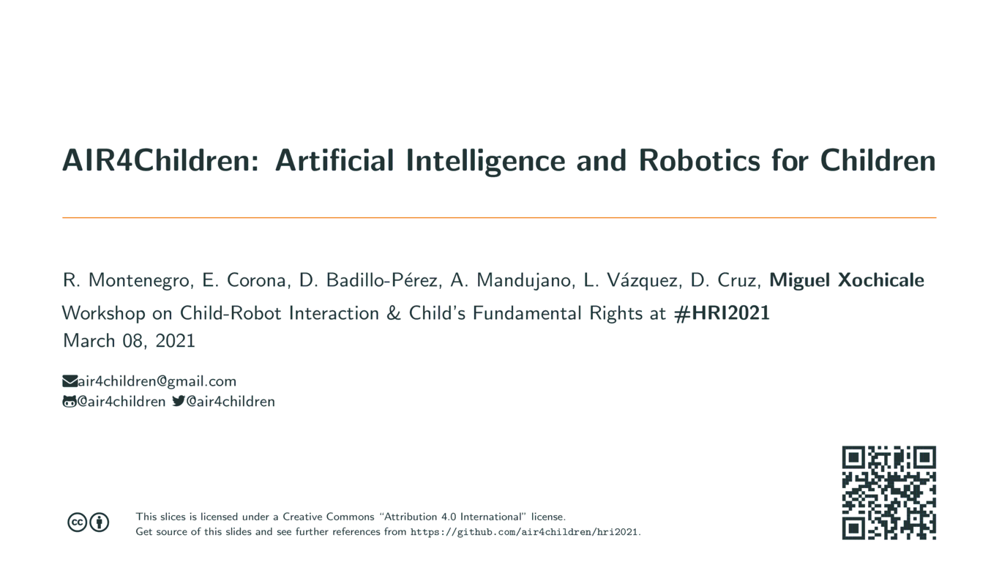

# AIR4Children: Artificial Intelligence and Robotics for Children 

## Abstract
We introduce AIR4Children, Artificial Intelligence for Children, as a way to (a) tackle aspects for inclusion accessibility, transparency, equity, fairness and participation and (b) to create affordable child-centred materials in AI and Robotics (AIR). 
We present current challenges and opportunities for a child-centred approaches for AIR. 
Similarly, we touch on open-sourced software and hardware technologies to make a more inclusive, affordable and fair participation of children in areas of AIR. 
Then, we describe the avenues that AIR4Children can take with the development of open-sourced software and hardware based on our initial pilots and experiences.
Similarly, we propose to follow the philosophy of Montessori education to help children to not only develop computational thinking but also to internalise new concepts and learning skills through activities of movement and repetition.
Finally, we conclude with the opportunities of our work and mainly we pose the future work of putting in practice what is proposed here to evaluate the potential impact on AIR to children, instructors, parents and their community. 

## Article and Slides (100% Reproducible)
[](https://github.com/air4children/hri2021/actions) [](https://github.com/air4children/hri2021/blob/pdfs/article.pdf)  [](https://github.com/air4children/hri2021/actions) [](https://github.com/air4children/hri2021/blob/pdfs/slides.pdf) (using [free-cortex framework](https://github.com/free-cortex/framework)).     



## Child-Robot Interaction & Child's Fundamental Rights
Workshop in conjunction with the ACM International Conference of Human-Robot Interaction (HRI2021)
8 March 2021 (online). See [README.md](workshop/README.md) to know more about the workshop.

## Licence and Citation 
This work is under Creative Commons Attribution-Share Alike license [](https://creativecommons.org/licenses/by-sa/4.0/). 
Hence, you are free to reuse it and modify it as much as you want and as long as you cite [this work](https://github.com/air4children/hri2021) as original reference and you re-share your work under the same terms.

## Cite as 
> Montenegro, R. (2021): AIR4Children: Artificial Intelligence and Robotics for Children. https://github.com/air4children/hri2021

## BibTeX to cite
```
@misc{montenegro2021air4children,
      title={AIR4Children: Artificial Intelligence and Robotics for Children}, 
      author={Rocio Montenegro and Elva Corona and Donato Badillo-Perez and Angel Mandujano and Leticia Vazquez and Dago Cruz and Miguel Xochicale},
      year={2021},
      eprint={2103.07637},
      archivePrefix={arXiv},
      primaryClass={cs.RO},
      url = {https://github.com/air4children/hri2021},
      series = {HRI '21}
}

```

## Contact 
If you have specific questions about the content of this repository, you can drop us an email to [air4children@gmail.com](mailto:air4children@gmail.com?subject="[questions]"). 
If your question might be relevant to other people, please instead [open an issue](https://github.com/air4children/hri2021/issues).
